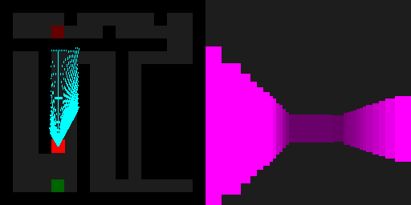

Project Name: Turtle Cam
Submission by Akrit Ghimire 18/11/23

-- Be sure to watch the PromoVideo.mp4 to set the atmosphere!
-- Link can be found here if not present in the file directory
-- Link: https://youtu.be/ul_8ifURjf0

Make sure you install this library as this is the library that is used to generate saveable images
-- JuicyPixels
-- I.e (cabal install JuicyPixels)

Idea

-- To create an application that will be the basis for such systems like warehouse robots that pathfind to different stocks for finding, retrieving and delivering desired items.

Components

-- A* Pathfinding algorithm implmentation in Haskell to make the 
-- turtle-bot move

-- Ray Caster implemented in Haskell using JuicyPixels to 
-- generate what the turtle-bot would
-- see as it moves through the maze

-- Map creator implemented in HTML and JavaScript to make creation
-- of a test map more streamlined for extensive testing of the
-- application

-- The HTML page also has a Raycaster viewer so that you can watch
-- the turtle-bot move in real time

Inspiration

-- This project was inspired by GriffPatch (YouTube) who created a
-- a series on how to make a raycaster in Scratch. Although I
-- didn't watch the entire series (only one episode in fact), it
-- inspired me, because if he could make a raycaster in a
-- programming language as limited as Scratch, then imagine what
-- you could make in Haskell of all things!

Quick Start

-- Open up and load Main.hs on ghci and split screen your screen
-- so that you can also open up Tools.html on the right.
-- run the main function in ghci and it will prompt you to 
-- enter a maze.txt file path. If you don't want to use the two 
-- demo maze files in the Input folder, you can create your own
-- using the 'Create Maze' tab in Tools.html. The command line
-- will prompt you to enter the path of this file so make sure
-- you store it somewhere that you remember. Once entered, if there
-- are no errors with the file. I.e you've met the criteria of
-- a maze file (a start and end point unobstructed). Then follow
-- the prompt. It will say that it is able to use your file. When
-- this happens, click enter on the terminal and click the
-- 'Body Cam' tab of Tools.html to watch the turtle move. The left
-- part of the image is a top down view of the maze. The blue lines
-- are the rays casted by the turtle. The right part of the image
-- is the raycast of the maze, essentially what it looks like in 3d
-- When the turtle reaches the end it will notify you on the
-- terminal.
