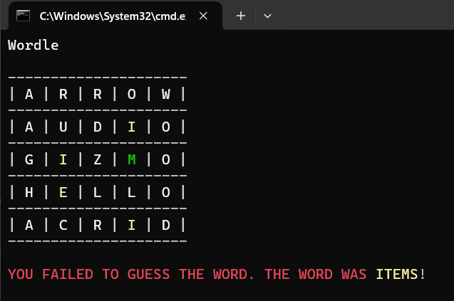

Wordle made in Haskell

This was my first 'real' project in Haskell, so I'm quite proud of it! The program reads the wordlist and then it generates a terminal display (which refreshes for a streamlined look). The user must enter in a 5 letter word and try to guess what the chosen word is. The program colours the letters accordingly, just like in the real online game (from The New York Times).